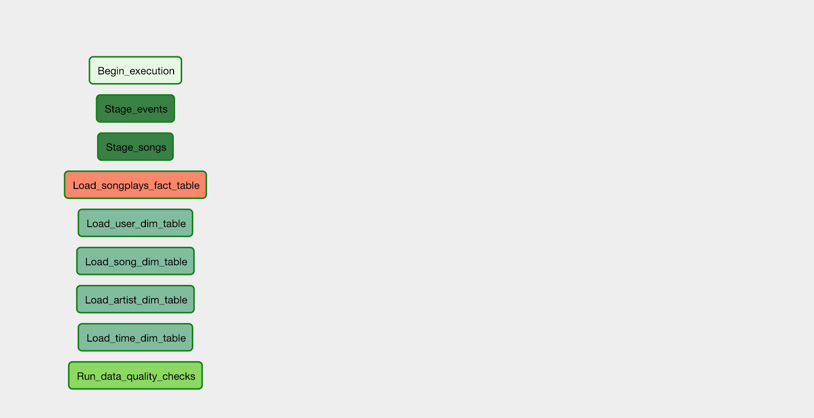

# Data Pipelines with Airflow

##### (Udacity Data Engineer Nano Degree Project 5)
---------------

**Introduction**


A music streaming company, Sparkify, has decided that it is time to introduce more automation and monitoring to their data warehouse ETL pipelines and come to the conclusion that the best tool to achieve this is Apache Airflow.


**The Goal**

In this project, as their data engineer, we are tasked with building an ETL pipeline that extracts their data from S3 and loads the data into Amazon Redshift 
by using Apache airflow.

**Database Source**

The source data is in log files given the Amazon S3 bucket:

 - Song data: s3://udacity-dend/song_data
 - Log data: s3://udacity-dend/log_data

**song_data** is in JSON format and contains metadata about a song and the artist of that song. The files are partitioned by the first three letters of each song's track ID. 


 ``` python
# An example of what a single song file

{"num_songs": 1, "artist_id": "ARJIE2Y1187B994AB7", "artist_latitude": null, "artist_longitude": null, "artist_location": "", "artist_name": "Line Renaud", "song_id": "SOUPIRU12A6D4FA1E1", "title": "Der Kleine Dompfaff", "duration": 152.92036, "year": 0}
 ```

**log_data** consists of log files in JSON format generated by this event simulator based on the songs in the dataset above. These simulate app activity logs from an imaginary music streaming app based on configuration settings.

An example of what the data in a log file


**Structure**

The tables have been arranged in a star schema.

***Fact Table***

The `songplays` table is the fact table and it contains foreign keys to dimension tables.
- songplay_id
- start_time
- user_id
- level
- song_id
- artist_id
- session_id
- location
- user_agent

***Dimension Tables***

- `users` - user_id, first_name, last_name, gender, level
- `songs` - song_id, title, artist_id, year, duration
- `artists` - artist_id, name, location, lattitude, longitude
- `time` - start_time, hour, day, week, month, year, weekday

DETAYLANDIR::

The project template package contains three major components for the project:

- The **hazal_dag.py** has all the imports tasks and dependencies
- The **operators** folder contains **data_quality.py**, **load_dimension.py**, **load_fact.py**, **starge_redshift.py** to define data pipeline
- the **helpers** folder contains **sql_queries.py** for the SQL transformations.

Dag before the dependencies are set:



Dag after the dependencies are set:


Operators:


**Data Pipeline** 

In this project most of ETL is done with Python:

- Firstly reads song_data and load_data from S3 to staging tables.
- From staging tables fact and dimension tables are been loading.
- **stage_redshift.py** contains  `StageToRedshiftOperator `, which loads any JSON formatted files from S3 to Amazon Redshift.
- **load_fact.py** contains  `LoadFactOperator `, which loads a fact table from data in the staging tables.
- **load_dimension.py** contains  `LoadDimensionOperator `, which loads a dimension table from data in the staging tables.
- **data_quality.py** contains  `DataQualityOperator `, which runs checks on the data itself. Main functionality is to receive one or more SQL based test cases along with the expected results and execute the tests


**To run the program**

-  From Airflow web server you can see your DAG and turn it on to run.


-----
NOTE: End of the project S3 bucket and Redshift Cluster have been deleted

Hazal Ciplak


